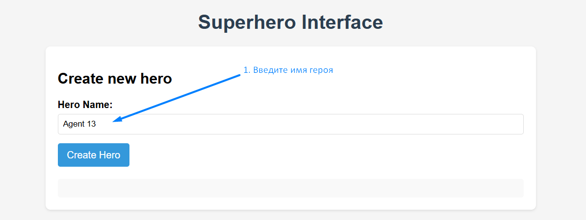
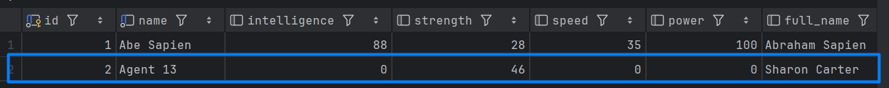
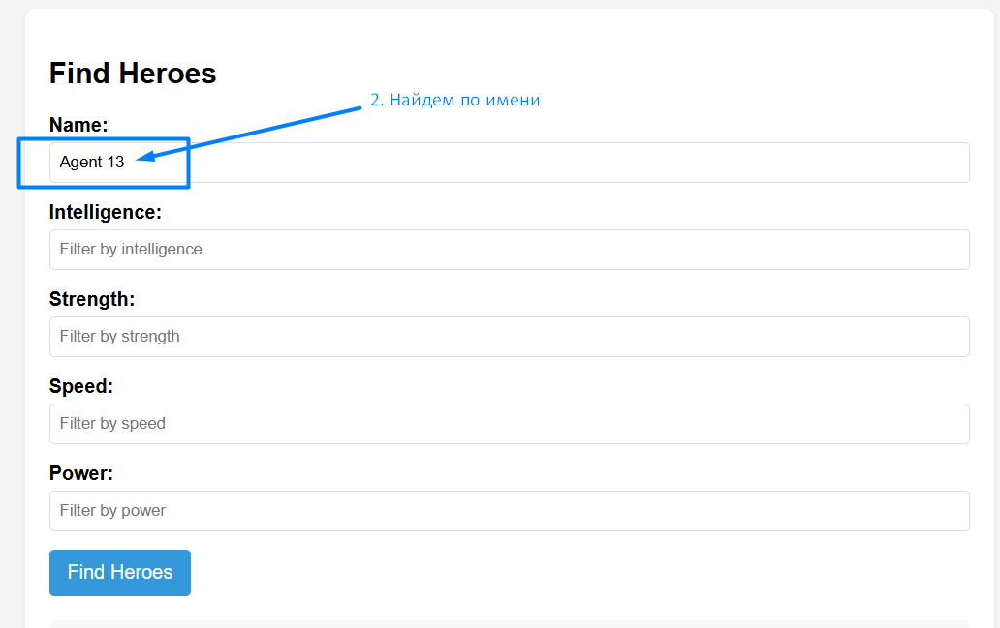
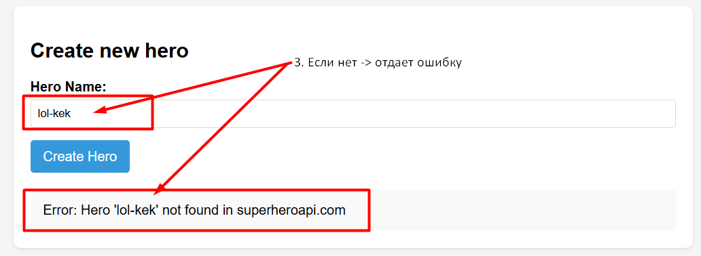
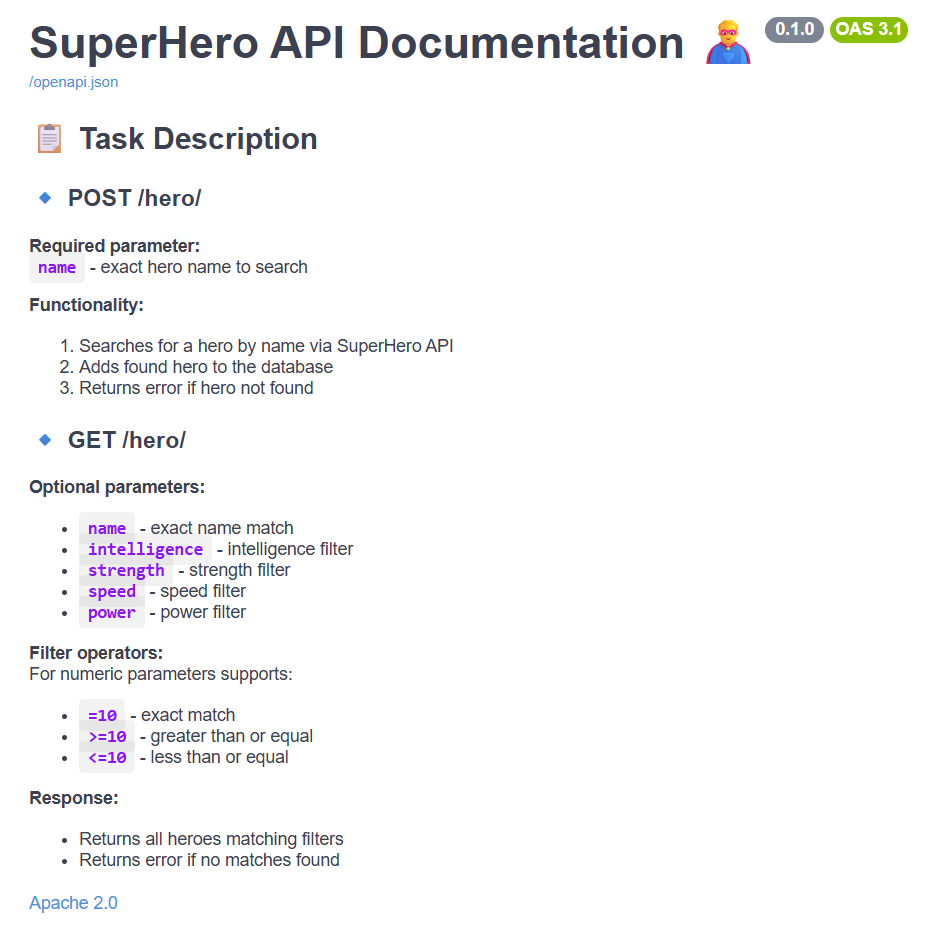
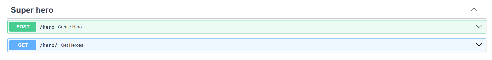

# Super Hero API Documentation

## Overview
API for searching and managing superheroes from the SuperHero API and storing them in a database.

## Requirements
- Python 3.9+
- PostgreSQL 13+
- Docker
- Poetry

## Installation

```bash
# Clone the repository
git clone https://github.com/marryivanova/super-hero.git

# Create and activate virtual environment
python -m venv venv
source venv/bin/activate  # Linux/Mac
venv\Scripts\activate     # Windows

# Install dependencies
cd super-hero
pip install poetry
poetry install

# Start database
cd docker
docker-compose -f docker-compose.yml up -d db

# Run migrations
alembic upgrade head  # Make sure to check database URL in alembic.ini

# Start the server
python main.py
```

**Frontend Note !!**:
Frontend microservice expects API at http://localhost:8000:
`const API_BASE_URL = 'http://localhost:8000'` 

**Swagger**:

`http://localhost:8000/docs`


**Example of work**:

#### table
<figure>
  
  <figcaption>Create new hero</figcaption>
</figure>

<figure>
  
  <figcaption>This hero was created in the database</figcaption>
</figure>

<figure>
  
  <figcaption>Find name</figcaption>
</figure>

<figure>
  
  <figcaption>Error message</figcaption>
</figure>

<figure>
  
  <figcaption>Swagger</figcaption>
</figure>


<figure>
  
  <figcaption>Swagger</figcaption>
</figure>

